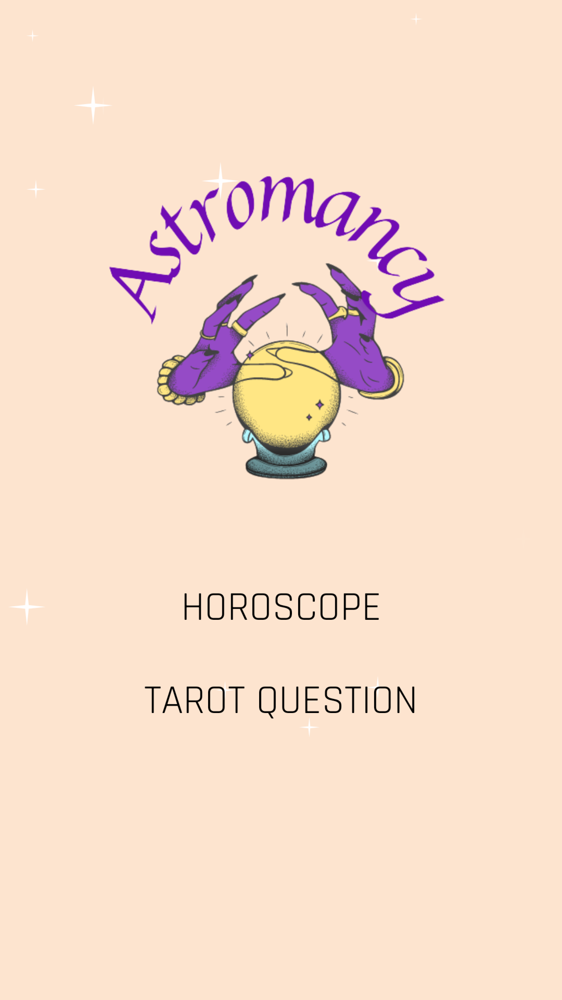
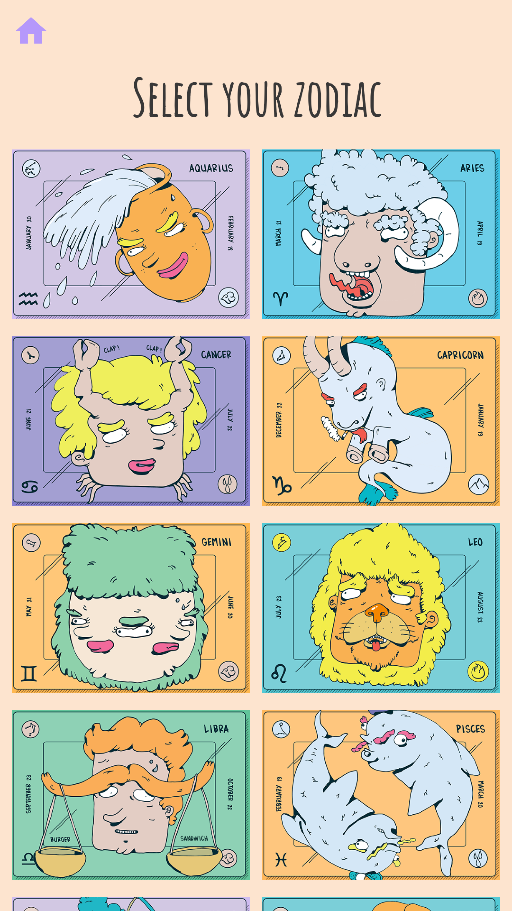
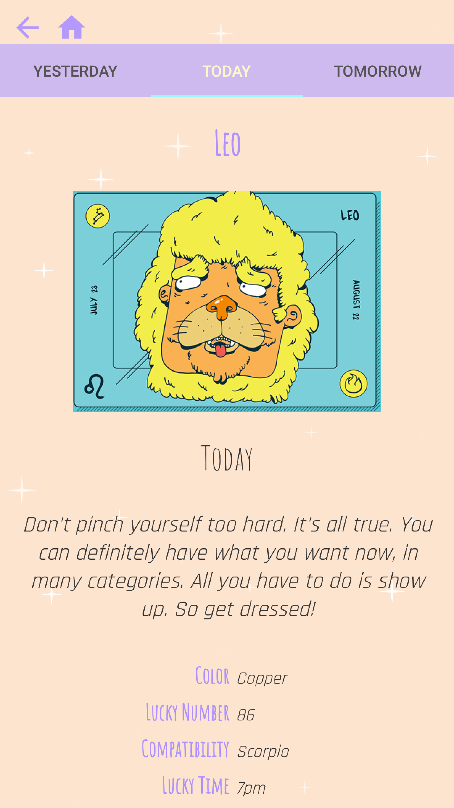
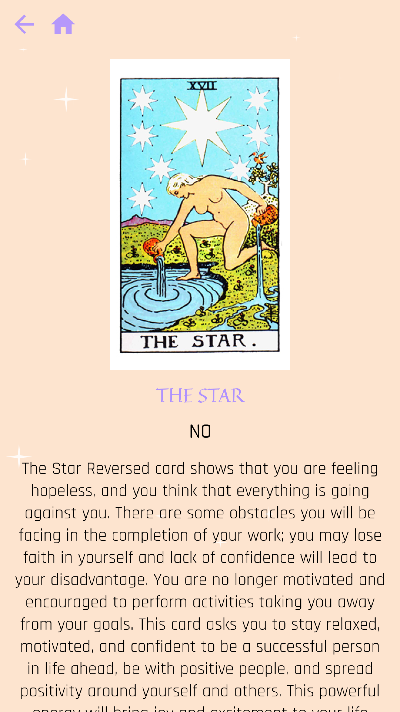

# ASTROMANCY

Esoteric app featuring a daily horoscope and a yes/no question and answer tarot

## Astromancy App
     

## TECHNOLOGIES

- Android studio
- Retrofit
- Coroutine
- Framer  
- Picasso
- Lottie
- Canva

## ENDPOINTS
### Horoscope
*POST https://aztro.sameerkumar.website/?starsign={STARSIGN}?day={YESTERDAY/TODAY/TOMORROW}*
With this post we're retrieving:
- Sign
- Description
- Current Date
- Color
- Lucky Number
- Compatibility
- Lucky Time
- Mood

### Tarot
*POST https://divineapi.com/api/1.0/get_yes_or_no_tarot.php* 
With this post we're retrieving:
- A card image- Card name
- Card Name
- **YES** or **NO** answer
- A description of the meaning of the card

This is a student project that was created by @hln-h @berovikak at CodeOp, an Android bootcamp in Barcelona.

